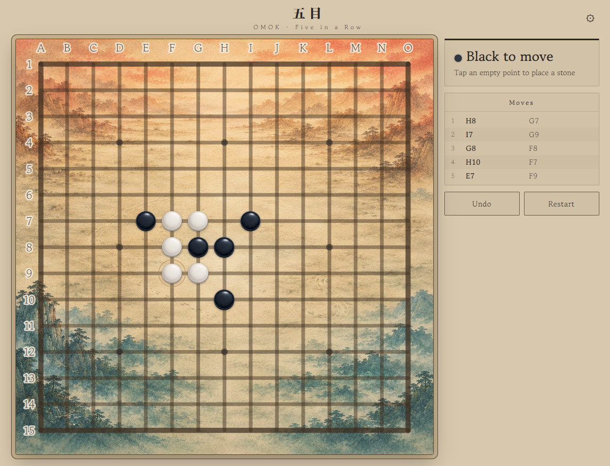

# Omok · 오목 (Korean Five-in-a-Row)

Traditional Korean Omok in your browser — a built-in AI with four difficulty
tiers, a renju (3-3) rule toggle, a movetext log with board coordinates,
multilingual support, and handcrafted Korean-inspired board themes and stones.
A companion piece to the Janggi project, sharing its ink-wash landscape and
porcelain-stone world.

**[▶ Play Online](https://omok-tea.pages.dev)**

<!-- TODO: 스크린샷 추가 →  -->

---

## Features

- **Play against the AI** — a self-implemented engine (alpha-beta minimax with a
  threat-aware evaluation), with four difficulty tiers:
  - 🌱 **Beginner** — for those just starting out; beatable with a little focus
  - 🍃 **Familiar Friend** — a casual game; punishes carelessness
  - 🎋 **Seasoned Player** — rarely leaves an opening
  - 🏮 **Master** — flawless, without a single gap
- **Local two-player** — place stones on the 15×15 grid; first to five in a row wins
- **Renju (3-3) rule toggle** — optionally forbid Black from making a double-three; off by default (free rule)
- **Move log with coordinates** — every move recorded as board coordinates (columns A–O, rows 1–15)
- **Board coordinate labels** — A–O / 1–15 along the edges, like a classic game record
- **Traditional Korean board themes**
  - Sansuhwa (Ink Wash Landscape)
  - Wood
  - Sipjangsaeng
  - Hanji
- **Handcrafted stones** — Baekja (white porcelain) and Meokbit (ink-toned) pebbles, fully top-down
- **Multiple languages**
  - English
  - 한국어 (Korean)
  - 日本語 (Japanese)
  - 简体中文 (Simplified Chinese)
  - 繁體中文 (Traditional Chinese)
  - Deutsch (German)
  - Français (French)
- **Mobile and desktop support** — responsive layout for both

---

## What is Omok?

Omok is a traditional board game in the "five in a row" family (known as
Gomoku elsewhere in East Asia). Players take turns placing stones on the
intersections of a 15×15 grid; the first to line up five of their own stones —
horizontally, vertically, or diagonally — wins.

This project optionally supports the **renju 3-3 rule**, under which Black may
not play a move that creates two "open threes" at once. It is a competitive
balancing rule (Black moves first and so has an advantage); it is off by default
and can be turned on in settings.

---

## The AI

The opponent is a from-scratch JavaScript engine — no external chess/board
engine, no WASM dependency.

- **Alpha-beta minimax** search over candidate moves near existing stones.
- **Threat-aware evaluation** — beyond raw line scores, it recognises *double
  threats* (e.g. two open threes formed in one move), which is most of what
  matters in Omok.
- **Difficulty by controlled imperfection** — weaker tiers occasionally pass over
  the best move for a slightly looser one (chosen from among the *next-best*
  candidates, never a random off-board blunder), while always still taking an
  immediate win and blocking an immediate loss. The opening few moves are always
  played at full strength, so the AI never "tips its hand" early.

---

## Tech

- Vanilla JavaScript, HTML, and CSS (no framework)
- No build step — a pure static site
- Self-contained AI logic in JavaScript; no external engine dependency
- Deployed on Cloudflare Pages

---

## License

The code and the visual assets are licensed separately.

- **Code** (`index.html`, `style.css`, `script.js`) — [MIT License](LICENSE).
  Unlike the Janggi project (which integrates GPLv3 Fairy-Stockfish), Omok has no
  such dependency, so the code is released under the permissive MIT license.
- **Visual assets** (board backgrounds, stone artwork, and other theme/UI images
  under `assets/`) — **All Rights Reserved** by Hanrim. They are *not* covered by
  the MIT license and may not be redistributed or reused when forking the code.
  See [ASSETS_LICENSE.md](ASSETS_LICENSE.md).
- **Sound assets** (`assets/sound/`) — third-party, from Pixabay; see
  [ASSETS_LICENSE.md](ASSETS_LICENSE.md) for attribution.

If you fork or redistribute this project, the MIT license applies to the code
only; the visual assets must not be redistributed with it.
